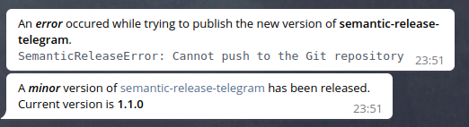

# semantic-release-telegram
[semantic-release][sr-url] plugin. Provides notifications to [Telegram][tg-url] chats.

[![Version][badge-vers]][npm]
[![Bundle size][npm-size-badge]][npm-size-url]
[![Downloads][npm-downloads-badge]][npm]

[![CodeFactor][codefactor-badge]][codefactor-url]
[![SonarCloud][sonarcloud-badge]][sonarcloud-url]
[![Codacy][codacy-badge]][codacy-url]
[![Total alerts][lgtm-alerts-badge]][lgtm-alerts-url]
[![Language grade][lgtm-lg-badge]][lgtm-lg-url]
[![Scrutinizer][scrutinizer-badge]][scrutinizer-url]

[![Dependencies][badge-deps]][npm]
[![Security][snyk-badge]][snyk-url]
[![Build Status][tests-badge]][tests-url]
[![Coverage Status][badge-coverage]][url-coverage]

[![Commit activity][commit-activity-badge]][github]
[![FOSSA][fossa-badge]][fossa-url]
[![License][badge-lic]][github]

## Table of Contents
  - [Requirements](#requirements)
  - [Installation](#installation)
  - [Usage](#usage)
  - [Contribute](#contribute)

## Requirements
[![Platform Status][node-ver-test-badge]][node-ver-test-url]

To use library you need to have [node](https://nodejs.org) and [npm](https://www.npmjs.com) installed in your machine:

* node `>=10`
* npm `>=6`

Package is [continuously tested][node-ver-test-url] on darwin, linux and win32 platforms. All active and maintenance [LTS](https://nodejs.org/en/about/releases/) node releases are supported.

## Installation

To install the library run the following command

```bash
  npm i --save semantic-release-telegram
```

## Usage
The plugin can be configured in the semantic-release [configuration file][sr-config]:

```json
{
  "plugins": [
    "@semantic-release/commit-analyzer",
    "@semantic-release/release-notes-generator",
    [ "semantic-release-telegram", {
      "chats": [ 123456789, -987654321 ]
    } ]
  ]
}
```
This is a minimal usage sample with a default configuration. Next messages will be sent:



### Configuration

if needed, the configuration can be extended:

```json
{
  "plugins": [
    "@semantic-release/commit-analyzer",
    "@semantic-release/release-notes-generator",
    ["semantic-release-telegram", {
      "name": "funny-app",
      "chats": [ 123456789 ],
      "templates": {
        "fail"    : "An error occured while trying to publish the new version of <b>{name}</b>.\n<pre><code class='language-javascript'>{error}</code></pre>",
        "success" : "A new version of <a href='{repository_url}'>{name}</a> has been released. Current version is <b>{version}</b>"
      }

    }]
  ]
}
```
Config attribute description:

| Option | Required | Type | Description | Default |
|----|---|---|------------------------------------|------------------------------------|
| `name`          | no | ```string```  | Heroku application name.    | name from package.json |
| `chats`    | yes | ```array``` | List of chats for sending. The bot should have access to each chat. |      |
| `templates.success`    | no |  ```string```  | HTML template, send in case of success. | [SUCCESS.html](templates/SUCCESS.html) |
| `templates.fail`    | no |  ```string```  | HTML template, send in case of fail. | [FAIL.html](templates/FAIL.html) |
| `assets`    | no |  ```array```  | List of files to upload. See [Assets](#assets) | `[]` |
| `telegra.ph`    | no |  ```object```  | Publish and attach [Telegraph](#Telegraph) story | `null` |

Template variables:

| key | Templates | Description | Example |
|----|---|-----------------------|--------|
| `repository_url` | success, fail | The git repository URL. By default repository property in package.json or git origin url | https://github.com/pustovitDmytro/semantic-release-telegram
| `name` | success, fail | application name | funny-app
| `version` | success | new version | 1.0.0
| `release_notes` | success | generated notes |
| `release_type` | success | | minor
| `commit` | success | commit hash | 13b16914f2893fa09e9a39f1dcda78af1fff0dbd
| `branch` | success, fail | | master
| `error` | fail | thrown error | SemanticReleaseError: Cannot push to the Git repository

### Authentication
To use this package, you need to [register](https://core.telegram.org/bots#3-how-do-i-create-a-bot) a new telegram bot. Then pass the next environment variables:

```sh
  TELEGRAM_BOT_ID=123456 
  TELEGRAM_BOT_TOKEN=ABC-DEF1234ghIkl-zyx57W2v1u123ew11
```

### Assets

Can be [glob](https://github.com/isaacs/node-glob#glob-primer) or relative file path. `name` specifies file label in telegram. In the case of glob pattern, all files are uploaded in a single archive, `name` is required.

Example:

```json
  "assets" : [
        { "path": "README.md" },
        { "glob": [ ".docs/*" ], "name": "Documentation.zip" }
    ]
```

Assets will be attached to release message as separate files.
### Telegraph

Upload bulky markdowns, as [telegra.ph](https://telegra.ph/) stories. Use next api for this:

```json
  "telegra.ph"  : {
    "title"   : "{name} v.{version}",
    "message" : "<a href='{telegraph_url}'>Release Notes</a>",
    "content" : "{release_notes}"
}
```

`title` and `content` represent story content.

`message` is a telegram message, sent to telegram chats (It is reasonable to include `{telegraph_url}` here). Success template is extended with new variables `{telegraph_url}` and `{telegraph_title}` when `telegra.ph` is used.

[sr-url]: https://github.com/semantic-release/semantic-release
[sr-config]: https://github.com/semantic-release/semantic-release/blob/master/docs/usage/configuration.md#configuration
[tg-url]: https://telegram.org/

## Contribute

Make the changes to the code and tests. Then commit to your branch. Be sure to follow the commit message conventions. Read [Contributing Guidelines](.github/CONTRIBUTING.md) for details.

[npm]: https://www.npmjs.com/package/semantic-release-telegram
[github]: https://github.com/pustovitDmytro/semantic-release-telegram
[travis]: https://travis-ci.org/pustovitDmytro/semantic-release-telegram
[coveralls]: https://coveralls.io/github/pustovitDmytro/semantic-release-telegram?branch=master
[badge-deps]: https://img.shields.io/librariesio/release/npm/semantic-release-telegram.svg
[badge-vuln]: https://img.shields.io/snyk/vulnerabilities/npm/semantic-release-telegram.svg?style=popout
[badge-vers]: https://img.shields.io/npm/v/semantic-release-telegram.svg
[badge-lic]: https://img.shields.io/github/license/pustovitDmytro/semantic-release-telegram.svg
[badge-coverage]: https://coveralls.io/repos/github/pustovitDmytro/semantic-release-telegram/badge.svg?branch=master
[url-coverage]: https://coveralls.io/github/pustovitDmytro/semantic-release-telegram?branch=master

[snyk-badge]: https://snyk-widget.herokuapp.com/badge/npm/semantic-release-telegram/badge.svg
[snyk-url]: https://snyk.io/advisor/npm-package/semantic-release-telegram

[tests-badge]: https://img.shields.io/circleci/build/github/pustovitDmytro/semantic-release-telegram
[tests-url]: https://app.circleci.com/pipelines/github/pustovitDmytro/semantic-release-telegram

[codefactor-badge]: https://www.codefactor.io/repository/github/pustovitdmytro/semantic-release-telegram/badge
[codefactor-url]: https://www.codefactor.io/repository/github/pustovitdmytro/semantic-release-telegram

[commit-activity-badge]: https://img.shields.io/github/commit-activity/m/pustovitDmytro/semantic-release-telegram

[scrutinizer-badge]: https://scrutinizer-ci.com/g/pustovitDmytro/semantic-release-telegram/badges/quality-score.png?b=master
[scrutinizer-url]: https://scrutinizer-ci.com/g/pustovitDmytro/semantic-release-telegram/?branch=master

[lgtm-lg-badge]: https://img.shields.io/lgtm/grade/javascript/g/pustovitDmytro/semantic-release-telegram.svg?logo=lgtm&logoWidth=18
[lgtm-lg-url]: https://lgtm.com/projects/g/pustovitDmytro/semantic-release-telegram/context:javascript

[lgtm-alerts-badge]: https://img.shields.io/lgtm/alerts/g/pustovitDmytro/semantic-release-telegram.svg?logo=lgtm&logoWidth=18
[lgtm-alerts-url]: https://lgtm.com/projects/g/pustovitDmytro/semantic-release-telegram/alerts/

[codacy-badge]: https://app.codacy.com/project/badge/Grade/8667aa23afaa4725854f098c4b5e8890
[codacy-url]: https://www.codacy.com/gh/pustovitDmytro/semantic-release-telegram/dashboard?utm_source=github.com&amp;utm_medium=referral&amp;utm_content=pustovitDmytro/semantic-release-telegram&amp;utm_campaign=Badge_Grade

[sonarcloud-badge]: https://sonarcloud.io/api/project_badges/measure?project=pustovitDmytro_semantic-release-telegram&metric=alert_status
[sonarcloud-url]: https://sonarcloud.io/dashboard?id=pustovitDmytro_semantic-release-telegram

[npm-downloads-badge]: https://img.shields.io/npm/dw/semantic-release-telegram
[npm-size-badge]: https://img.shields.io/bundlephobia/min/semantic-release-telegram
[npm-size-url]: https://bundlephobia.com/result?p=semantic-release-telegram

[node-ver-test-badge]: https://github.com/pustovitDmytro/semantic-release-telegram/actions/workflows/npt.yml/badge.svg?branch=master
[node-ver-test-url]: https://github.com/pustovitDmytro/semantic-release-telegram/actions?query=workflow%3A%22Node.js+versions%22

[fossa-badge]: https://app.fossa.com/api/projects/custom%2B24828%2Fsemantic-release-telegram.svg?type=shield
[fossa-url]: https://app.fossa.com/projects/custom%2B24828%2Fsemantic-release-telegram?ref=badge_shield